---
# Dataset
---
Two dataset will be used by the clustering algorithm.
1. The full dataset
2. A subset of the dataset 

### Full dataset
| Column name             | Units  |
|--------------------------------------|--------|
| Food Sub-group                      | None   |
| Season Code                          | 0: out of season 1: in season 2: mixed consumption |
| Airplane Code                        | 0: not by airplane  1: by airplane |
| Delivery (temperature and distance)  | None   |
| Packaging Approach                   | None   |
| Preparation (cooking)                | None   |
| Climate Change                       | kg CO2 eq/kg de produit |
| Ozone Layer Depletion                | kg CVC11 eq/kg de produit |
| Ionizing Radiation                   | kBq U-235 eq/kg de produit |
| Photochemical Ozone Formation        | kg NMVOC eq/kg de produit |
| Fine Particles                       | disease inc./kg de produit |
| Toxicological Effects on Human Health: Non-carcinogenic Substances | CTUh/kg de produit |
| Toxicological Effects on Human Health: Carcinogenic Substances | CTUh/kg de produit.1 |
| Terrestrial and Freshwater Acidification | mol H+ eq/kg de produit |
| Freshwater Eutrophication            | kg P eq/kg de produit |
| Marine Eutrophication                | kg N eq/kg de produit |
| Terrestrial Eutrophication           | mol N eq/kg de produit |
| Ecotoxicity for Freshwater Aquatic Ecosystems | CTUe/kg de produit |
| Land Use                             | Pt/kg de produit |
| Water Resource Depletion             | m³ depriv./kg de produit |
| Energy Resource Depletion            | MJ/kg de produit |
| Mineral Resource Depletion           | kg Sb eq/kg de produit |
| Climate Change - Biogenic Emissions  | kg CO2 eq/kg de produit.1 |
| Climate Change - Fossil Emissions    | kg CO2 eq/kg de produit.2 |
| Climate Change - Emissions from Land Use Change                           | kg CO2 eq/kg de produit.3              |

### Data subset
| Column name               | Units  |
|--------------------------------------|--------|
| Climate Change                       | kg CO2 eq/kg de produit |
| Photochemical Ozone Formation        | kg NMVOC eq/kg de produit |
| Fine Particles                       | disease inc./kg de produit |
| Toxicological Effects on Human Health: Non-carcinogenic Substances | CTUh/kg de produit |
| Toxicological Effects on Human Health: Carcinogenic Substances | CTUh/kg de produit.1 |
| Freshwater Eutrophication            | kg P eq/kg de produit |
| Marine Eutrophication                | kg N eq/kg de produit |
| Ecotoxicity for Freshwater Aquatic Ecosystems | CTUe/kg de produit |
| Land Use                             | Pt/kg de produit |
| Water Resource Depletion             | m³ depriv./kg de produit |
| Energy Resource Depletion            | MJ/kg de produit |
| Mineral Resource Depletion           | kg Sb eq/kg de produit |

---
# Analysis
---

Most Food have an Environmental Footprint (EF) Score between 0 and 2.

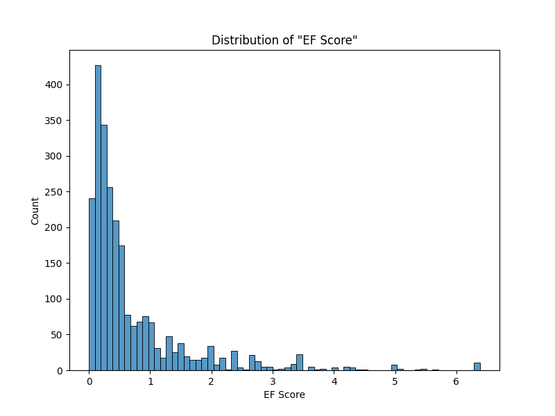

  

The food group 'Meat, Eggs, Fish' contains the food with the highest EF Score.
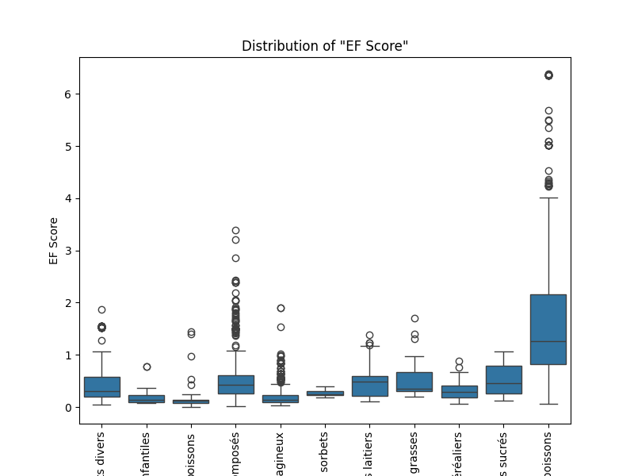

  

Of the group 'Meat, Eggs, Fish', the food sub-group 'Meat', 'Fish' and 'Shellfish' contains the food with the highest EF Score.
On the other hand, 'Eggs' and 'Meat Substitutes' have a very low EF SCore.

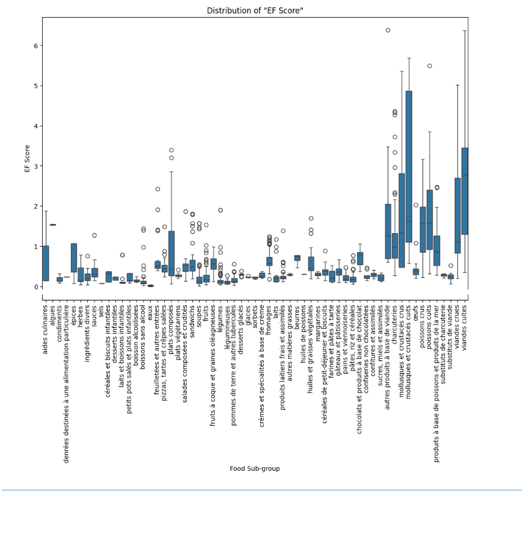

  
The delivery method 'Iced' has the highest EF Score.
**It is important to note that and Iced delivery has an significant higher EF Score than a Frozen deliver**

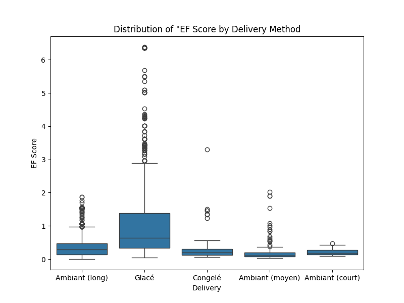

  

Using the 'Stove' and 'Oven' to preapare a meal leads to higher EF Score

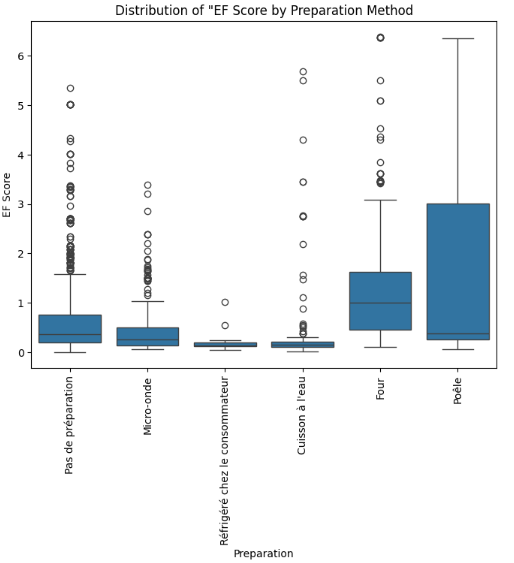

---
# Our models
---

### **KMeans**

1. Full dataset
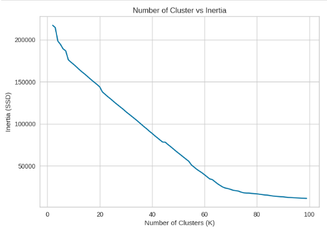

Tested 3 K value for KMeans clustering 60,80,90. However, none captured the grouping by EF Score that we were expecting. The food seems to be grouped by food category.

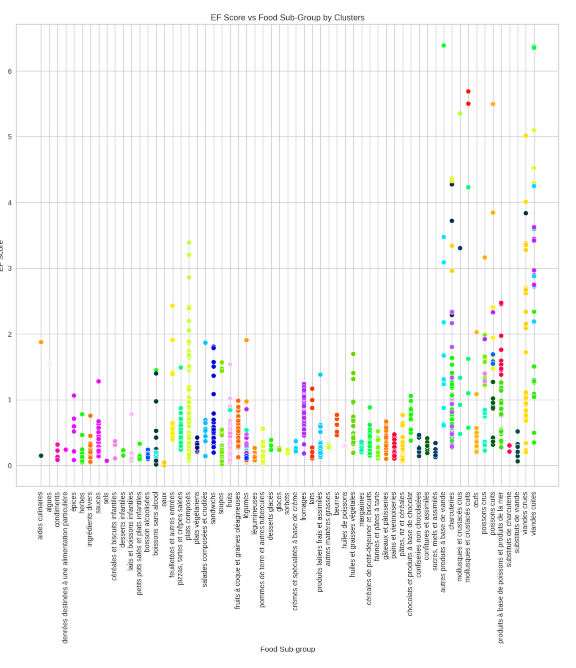

2. Data Subset

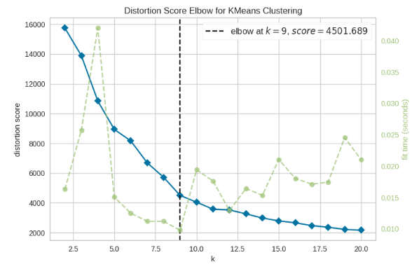

Tested many K value for KMeans. However, 10 clusters was performing better by capturing the right amount of cluster and regrouping food with similar EF score together.

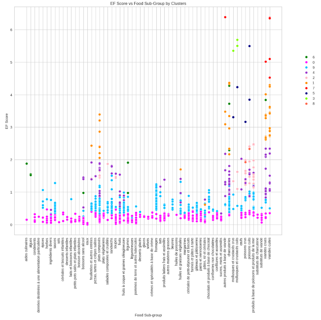

KMeans were able to group food by EF Score. 

### **Agglomerative Clustering (AC)**

For all AC model the metric was et to 'euclidean' and the linkage was set to 'ward'.

1. Full dataset
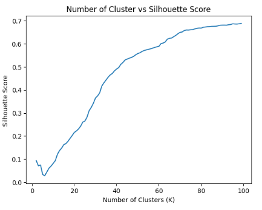

Tested 3 K value for AC clustering 60,80,90. However, none captured the grouping by EF Score that we were expecting. The food seems to be grouped by food category.

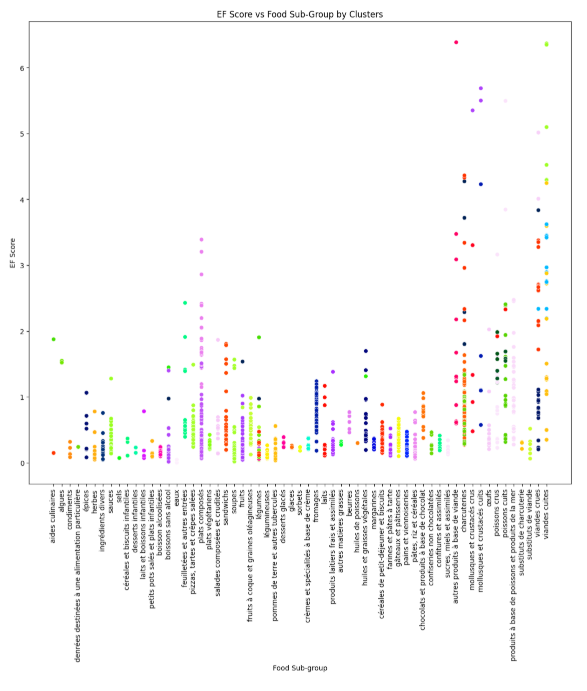

2. Data Subset

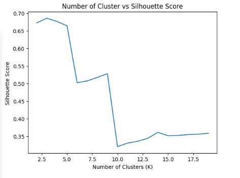

Tested many K value for KMeans. However, 10 clusters was performing better by capturing the right amount of cluster and regrouping food with similar EF score together.

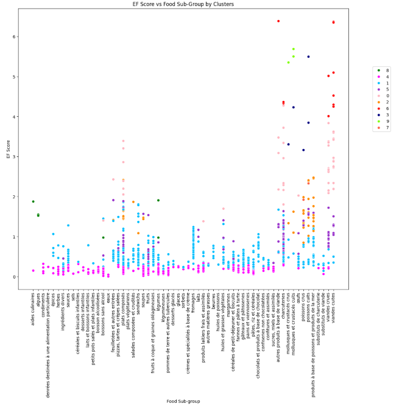

AC was the best at grouping food by EF Score. 
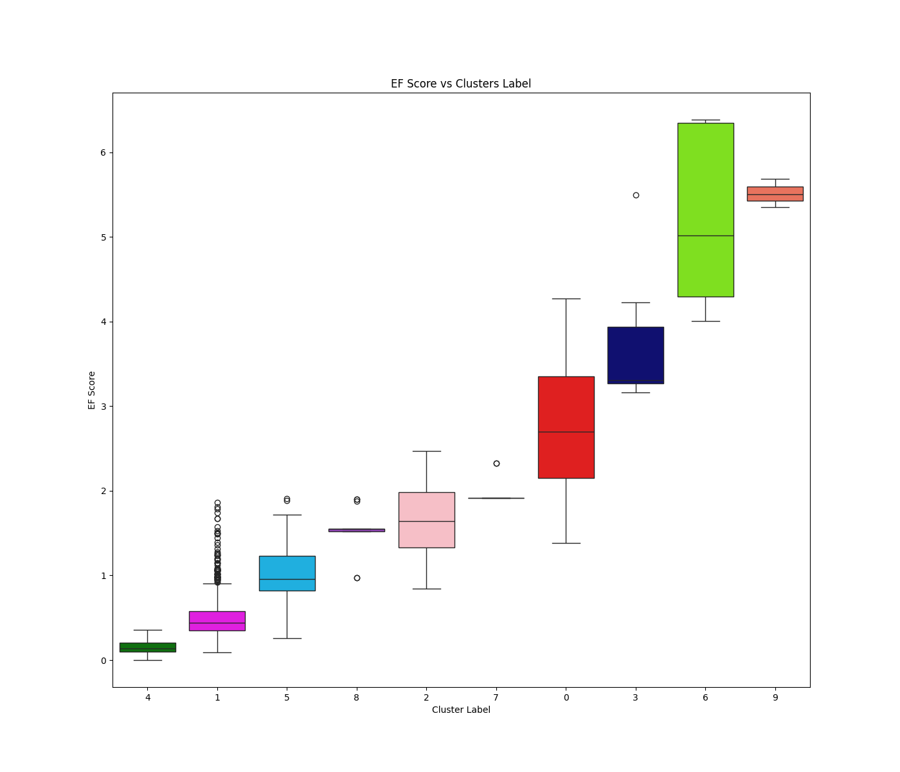

### **DBSCAN**
DBSCAN is not able to capture the right amount of clusters. 

Tried various parameters, but in the end I believe my dataset is not dense enough to be using that algorithm.

---
# Results of the best Clustering model - Agglomerative Clustering
---

| Cluster | Environmental Footprint          | Key Characteristics |
|---------|----------------------------------------|----------------------|
| 4       | Lowest      | - Lowest Fine Particles    - Lowest Ecotoxicity for Freshwater Aquatic System    - Low Land Use    - Lowest Energy Resource Depletion    - Lowest Climate Change Impact |
| 1       | Low         | - Low Fine Particles    - Low Ecotoxicity for Freshwater Aquatic System    - Moderate Land Use    - Low Energy Resource Depletion    - Low Climate Change Impact |
| 5       | Low           | - Moderate Photochemical Ozone Formation    - Low Water Eutrophication    - High Water Resource Depletion    - Low Mineral Resource Depletion    - Low Climate Change Impact |
| 8       | Moderate-Low | - Low Land Use    - High Energy Resource Depletion    - Low-Moderate Climate Change |
| 2       | Moderate    | - High Photochemical Ozone Formation    - High Fine Particles    - Low Ecotoxicity for Freshwater Aquatic System    - Low Land Use    - Second Lowest Water Resource Depletion    - Moderate Energy Resource Depletion    - Low-Moderate Climate Change |
| 7       | Moderate       | - Highest Water Eutrophication    - High Land Use    - Low Water Resource Depletion    - Moderate Energy Resource Depletion    - Moderate Climate Change |
| 0       | Moderate-High | - High Ecotoxicity for Freshwater Aquatic System    - Second Highest Land Use    - Moderate Water Resource Depletion    - Second Highest Climate Change Impact |
| 3       | High         | - Highest Freshwater Eutrophication    - Extreme Water Resource Depletion |
| 6       | High          | - High Ecotoxicity for Freshwater Aquatic System    - Highest Land Use    - Highest Climate Change Impact |
| 9       | Highest       | - Highest Photochemical Ozone Formation    - Highest Ecotoxicity for Freshwater Aquatic System    - Highest Energy Resource Depletion    - Highest Mineral Resource Depletion |

  

**What kind of produce are found in the Highest Environmental Footprint Categorie (9-6)?**
Answer: Mostly red meat (Lamb, Beef, Mouton) and shellfish with delivery methods 'iced'.

| Cluster | Food Group                                   | Count |
|---------|----------------------------------------------|------------------|
| 4       | aides culinaires et ingrédients divers      | 74               |
|         | aliments infantiles                         | 30               |
|         | boissons                                    | 131              |
|         | entrées et plats composés                   | 85               |
|         | fruits, légumes, légumineuses et oléagineux | 314              |
|         | glaces et sorbets                           | 14               |
|         | lait et produits laitiers                  | 81               |
|         | matières grasses                           | 4                |
|         | produits céréaliers                        | 159              |
|         | produits sucrés                            | 13               |
|         | viandes, œufs, poissons                    | 20               |
| 1       | aides culinaires et ingrédients divers      | 65               |
|         | aliments infantiles                         | 8                |
|         | boissons                                    | 5                |
|         | entrées et plats composés                   | 179              |
|         | fruits, légumes, légumineuses et oléagineux | 96               |
|         | glaces et sorbets                           | 11               |
|         | lait et produits laitiers                  | 139              |
|         | matières grasses                           | 47               |
|         | produits céréaliers                        | 214              |
|         | produits sucrés                            | 38               |
|         | viandes, œufs, poissons                    | 137              |
| 5       | aides culinaires et ingrédients divers      | 1                |
|         | boissons                                    | 1                |
|         | entrées et plats composés                   | 15               |
|         | fruits, légumes, légumineuses et oléagineux | 13               |
|         | lait et produits laitiers                  | 2                |
|         | matières grasses                           | 6                |
|         | produits céréaliers                        | 2                |
|         | produits sucrés                            | 2                |
|         | viandes, œufs, poissons                    | 207              |
| 8       | aides culinaires et ingrédients divers      | 17               |
|         | boissons                                    | 1                |
|         | fruits, légumes, légumineuses et oléagineux | 3                |
| 2       | entrées et plats composés                   | 18               |
|         | viandes, œufs, poissons                    | 107              |
| 7       | viandes, œufs, poissons                    | 11               |
| 0       | boissons                                    | 1                |
|         | entrées et plats composés                   | 12               |
|         | lait et produits laitiers                  | 1                |
|         | matières grasses                           | 1                |
|         | viandes, œufs, poissons                    | 121              |
| 3       | viandes, œufs, poissons                    | 8                |
| 6       | viandes, œufs, poissons                    | 34               |
| 9       | viandes, œufs, poissons                    | 3                |

  

**What kind of produce are found in the Highest Environmental Footprint Categorie (3,0)?**
  - Mostly red meat (Beef, Veal) and duck meat with delivery method 'iced'

**Is there product with delivery 'glacé' in category with moderate and low Environmental footprint category?**
  - Yes

**Can I still eat meat while trying to minimize my Environmental Footprint?**
  - You can still eat eggs, fish, poultry and and pork and still have a low Environmental Footprint Score diet.

**Can I still buy prepared food for a lazy night or a quick meal while minimizing my Environmental Footprint?**
  - Yes, most prepared-meal are found in low Environmental Footprint Score clusters.

---
# Conclusion
---
By using the Agglomerative Clustering algorithm we were able to group the food dataset into 10 clusters. 

The unsupervised Agglomerative Clustering algorithm was able to capture that the difference in the food clusters was their Environmental Footprint. 
